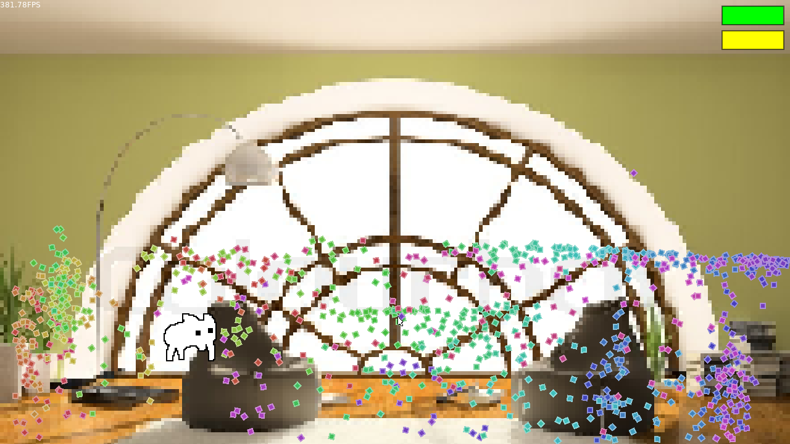

# babgotchi

a tamagotchi bab spinoff!

## how-to install:

### stable releases

1. download the file for your matching os from the releases tab on the repo
2. run it
3. enjoy your new pet bab!

if your os isn't listed, get the source code zip and skip step 1 in "unstable releases"

### unstable releases

1. download/clone/whatever the repository
2. follow the instructions here: [click!](http://love2d.org/wiki/Getting_Started#Running_Games)
3. enjoy your new pet bab!

## screenshots!
enjoy bab's company!!!

feed bab treats!!!

pet bab!!!

